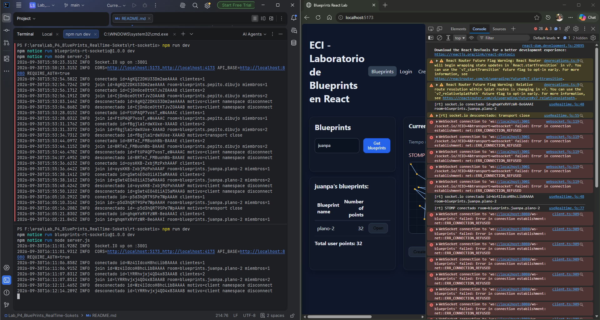
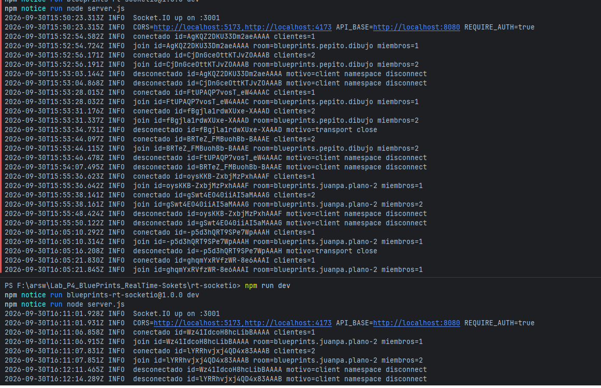
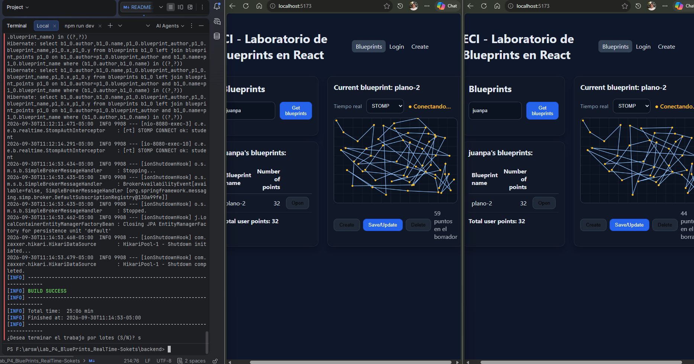
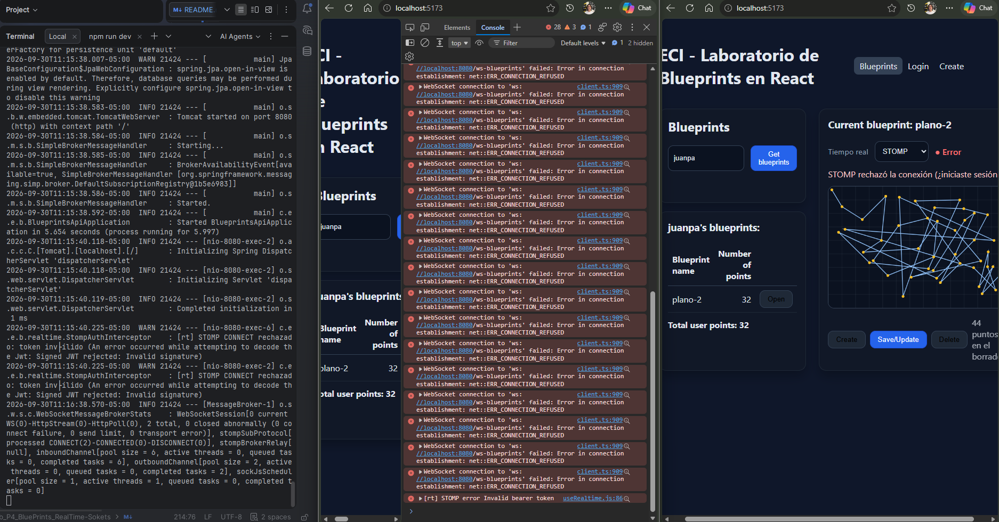

# Lab P4 — BluePrints en Tiempo Real (Socket.IO & STOMP)

Colaboración en vivo sobre planos: varias pestañas dibujan el mismo plano a la vez.
Este repo **integra el Lab P3** (front React + Redux + JWT y backend Spring Boot + PostgreSQL) con **tiempo real**:

- **Socket.IO** → servicio Node en `rt-socketio/` (contrato del backend guía).
- **STOMP** → agregado **dentro del backend de P3** (`backend/.../realtime`), sin levantar un segundo Spring.

## Arquitectura

```
React (Vite, :5173)
 ├─ REST + JWT ────────────────────────────> Backend Spring P3 (:8080)  ── PostgreSQL (:5432)
 │    login, CRUD, estado inicial del plano        │
 ├─ STOMP  /app/draw → /topic/blueprints.*  ───────┘  (ws://localhost:8080/ws-blueprints)
 └─ Socket.IO join-room / draw-event ─────> rt-socketio (Node, :3001)
                                                 └─ valida el JWT/plano preguntándole a la API (:8080)
```

| Qué | De dónde salió |
|---|---|
| Front (login, rutas privadas, Redux, tabla, total de puntos, canvas, CRUD) | Lab P3 (sin cambios de comportamiento) |
| API CRUD + JWT + PostgreSQL | Lab P3 (`/api/v1/blueprints`, `/auth/login`) |
| Endpoint `GET /api/blueprints/...` de los backends guía | **No se usa**: P3 ya lo cubre con datos reales |
| Servidor Socket.IO (`join-room` / `draw-event` / `blueprint-update`) | Backend guía Node, ampliado (ver más abajo) |
| STOMP (`/ws-blueprints`, `/app/draw`, `/topic/...`) | Backend guía Spring, **portado al backend P3** |
| Selector RT (None / Socket.IO / STOMP), hook `useRealtime`, barra de acciones | Nuevo en P4 |

## Estructura

```
├─ src/                    Front (React)
│  ├─ hooks/useRealtime.js       conexión RT (Socket.IO o STOMP) por plano
│  ├─ lib/socketIoClient.js      cliente Socket.IO (WebSocket, token en handshake)
│  ├─ lib/stompClient.js         cliente STOMP (token en frame CONNECT)
│  ├─ components/RealtimeSelector.jsx
│  └─ pages/BlueprintsPage.jsx   canvas + selector RT + Create / Save/Update / Delete
├─ backend/                Spring Boot (P3) + paquete `realtime` (STOMP)
├─ rt-socketio/            Servicio Node Socket.IO
├─ tests/                  Vitest (front)
├─ docs/LAB_P3_README.md   README original del Lab P3 (evidencias)
└─ docker-compose.yml      db + backend + rt-socketio + web
```

## Puesta en marcha

Requisitos: Node 18+ (recomendado 20), Java 21 + Maven, Docker (para PostgreSQL).
Credenciales de prueba: `student` / `student123`.

### Opción A — todo con Docker

```bash
docker compose up --build
# Front http://localhost:5173 · API http://localhost:8080 · Socket.IO http://localhost:3001
```

### Opción B — desarrollo local (3 terminales)

```bash
# 0) Base de datos
docker compose up -d db

# 1) Backend Spring (CRUD + JWT + STOMP)          -> http://localhost:8080
cd backend && mvn spring-boot:run

# 2) Servicio Socket.IO                            -> http://localhost:3001
cd rt-socketio && npm install && npm run dev

# 3) Front                                         -> http://localhost:5173
npm install
cp .env.example .env      # Windows PowerShell: Copy-Item .env.example .env
npm run dev
```

### Variables de entorno

Front (`.env`):

| Variable | Default | Uso |
|---|---|---|
| `VITE_API_BASE_URL` | `http://localhost:8080` | REST + login |
| `VITE_IO_BASE` | `http://localhost:3001` | Socket.IO |
| `VITE_STOMP_BASE` | `= VITE_API_BASE_URL` | STOMP (`http→ws` automático) |

`rt-socketio/.env` (ver `.env.example`): `PORT`, `CORS_ORIGINS`, `API_BASE`, `REQUIRE_AUTH`.
Backend (`application.yml`): `blueprints.realtime.allowed-origins`, `blueprints.realtime.require-auth`.

## Cómo probar la colaboración

1. Abre `http://localhost:5173/login` e inicia sesión (`student` / `student123`).
2. Crea un plano con **Create** (autor y nombre, por ejemplo `juan` / `plano-1`).
3. En **Blueprints**: escribe el autor → **Get blueprints** → **Open** en el plano.
4. En el selector **Tiempo real** elige **Socket.IO** o **STOMP**; el indicador debe pasar a `● En vivo`.
5. Abre **una segunda pestaña**, inicia sesión (el token es por origen: la sesión se comparte), abre el **mismo plano** y elige la **misma tecnología**.
6. Haz clic en el canvas en una pestaña: el punto aparece en la otra al instante.
7. **Save/Update** persiste el dibujo (RT es efímero); la tabla y el **Total user points** se actualizan.

> Importante: ambas pestañas deben estar en el **mismo plano** y con la **misma tecnología**
> (Socket.IO y STOMP son canales distintos y no se hablan entre sí).

### Casos de prueba mínimos

| Caso | Resultado esperado |
|---|---|
| Estado inicial | Al hacer **Open**, el canvas carga los puntos (`GET /api/v1/blueprints/{author}/{name}`) |
| Dibujo local | Clic en canvas agrega el punto y redibuja (también con RT = None) |
| RT multi-pestaña | Con 2 pestañas en el mismo plano, los puntos se replican casi al instante |
| Aislamiento | Una pestaña en otro plano **no** recibe los puntos |
| CRUD | Create / Save-Update / Delete funcionan y refrescan lista y total |
| Reconexión | Reinicia `rt-socketio` (o el backend): el indicador pasa a `Conectando…` y vuelve a `En vivo` |

## API REST usada (backend P3)

Todas requieren `Authorization: Bearer <JWT>` salvo el login.

| Método | Ruta | Uso |
|---|---|---|
| POST | `/auth/login` | Obtener JWT |
| GET | `/api/v1/blueprints` | Catálogo / autores |
| GET | `/api/v1/blueprints/{author}` | Planos del autor (el front calcula el total con `reduce`) |
| GET | `/api/v1/blueprints/{author}/{name}` | Puntos del plano (estado inicial) |
| POST | `/api/v1/blueprints` | Crear |
| PUT | `/api/v1/blueprints/{author}/{name}` | Guardar / actualizar puntos |
| DELETE | `/api/v1/blueprints/{author}/{name}` | Eliminar |

## Protocolos de tiempo real

Convención común: sala/tópico `blueprints.{author}.{name}`; punto `{ x, y }`.
En ambos casos los mensajes de `blueprint-update` traen **solo el punto nuevo** (`points: [{x,y}]`).

### Socket.IO (`rt-socketio`)

| Dirección | Evento | Payload |
|---|---|---|
| cliente → servidor | `join-room` | `room`, `{ author, name }`, `ack` (los dos últimos son extensiones opcionales) |
| cliente → servidor | `draw-event` | `{ room, author, name, point: {x,y} }` |
| servidor → sala (sin el emisor) | `blueprint-update` | `{ author, name, points: [{x,y}] }` |
| servidor → cliente | `rt-error` | `{ event, code, message }` (`invalid`, `unauthorized`, `not-found`, `not-joined`, …) |

Extras respecto al backend guía: validación con **zod** (tipos, rango de coordenadas, `room` coherente con `author/name`),
exigir `join-room` antes de dibujar, autorización por plano (ver Seguridad), CORS por lista de orígenes,
logs de conexión/join/leave/errores y `GET /health`.

### STOMP (backend Spring, paquete `co.edu.eci.blueprints.realtime`)

| Dirección | Destino | Payload |
|---|---|---|
| cliente → servidor | `SEND /app/draw` | `{ author, name, point, clientId }` |
| servidor → suscriptores | `/topic/blueprints.{author}.{name}` | `{ author, name, points: [point], clientId }` |

Endpoint WebSocket: `ws://localhost:8080/ws-blueprints`. STOMP retransmite **también al emisor**, por eso el front
envía un `clientId` por pestaña y descarta su propio eco (Socket.IO usa `socket.to(room)` y no lo necesita).

## Decisiones de diseño

- **RT efímero, persistencia por REST.** El RT solo retransmite; el botón **Save/Update** guarda en PostgreSQL. Un plano
  abierto más tarde carga lo último guardado, no los trazos sin guardar de otros.
- **Borrador local.** El canvas dibuja sobre un borrador (`draftPoints`); los puntos remotos se agregan a él.
  El borrador solo se reinicia al (re)abrir el plano (`currentVersion` en el slice), no al guardar, para no perder
  puntos que lleguen mientras se guarda.
- **Un solo backend.** STOMP vive en el backend de P3 (mismo puerto 8080, misma seguridad) en lugar de un segundo servicio Spring.
- **Sala por plano.** El nombre de sala/tópico incluye autor y nombre, lo que da el aislamiento entre planos.
- **Reconexión.** Socket.IO se re-une a la sala en cada evento `connect` (también tras reconectar); STOMP reintenta cada 2 s
  y se re-suscribe en `onConnect`. Con token inválido STOMP deja de reintentar.

## Seguridad

- **JWT en tiempo real.** El navegador no puede enviar el header `Authorization` en el handshake WebSocket, así que:
  - **STOMP:** el JWT viaja en el frame `CONNECT` y lo valida `StompAuthInterceptor` con el mismo `JwtDecoder` de la API
    (`/ws-blueprints/**` queda abierto solo para el handshake). Desactivable con `blueprints.realtime.require-auth=false`.
  - **Socket.IO:** el JWT viaja en `auth.token`; al hacer `join-room` el servidor le pregunta a la API
    `GET /api/v1/blueprints/{author}/{name}` con ese token (200 = permitido, 401/403 = rechazado, 404 = plano inexistente).
    Así la autorización por plano la decide la API, que es la única con las llaves. Desactivable con `REQUIRE_AUTH=false`.
- **Validación de payloads** en ambos servidores; **CORS/orígenes** restringidos a `localhost:5173` y `4173` (cámbialos en producción).
- Las llaves RSA del JWT se generan al arrancar el backend: al reiniciarlo los tokens anteriores dejan de valer (hay que volver a hacer login).

## Comparativa Socket.IO vs STOMP (para el análisis)

| | Socket.IO (Node) | STOMP (Spring) |
|---|---|---|
| Modelo | Rooms + eventos propios | Destinos (`/app`, `/topic`) sobre WebSocket |
| Eco al emisor | No (`socket.to(room)`) | Sí (hay que filtrar con `clientId`) |
| Reconexión | Incorporada, con backoff | `reconnectDelay` en stompjs; re-suscripción manual |
| Servicio extra | Sí (Node, puerto 3001) | No (dentro del backend existente) |
| Auth con JWT | Manual (delegada a la API) | Interceptor en el canal de entrada (mismo decoder) |
| Protocolo | Propio de Socket.IO (cliente y servidor deben ser Socket.IO) | Estándar (cualquier cliente STOMP) |
| Escalado horizontal | Adapter (p. ej. Redis) | Broker externo (RabbitMQ/ActiveMQ) en lugar del simple broker |

Para la sección de **latencia/reconexión** con datos propios: mide en el navegador (pestaña Network → WS) el tiempo entre el
clic en una pestaña y el pintado en la otra, y prueba a apagar y encender el servicio RT / el backend con ambas pestañas abiertas.

## Pruebas automáticas

```bash
npm test              # front: canvas, selector, hook useRealtime (con sockets simulados), slice, página
npm run lint
npm run test:rt       # servicio Socket.IO: broadcast, aislamiento, validación, auth, /health
```

## Troubleshooting

- **Login: “Credenciales inválidas o servidor no disponible”**: verifica que el backend esté en `:8080`; si creaste/cambiaste `.env`, reinicia `npm run dev` (Vite solo lee el `.env` al arrancar).
- **El indicador queda en “Error – Inicia sesión…”**: falta el token; entra por `/login` (o expiró / se reinició el backend).
- **No hay broadcast**: ambas pestañas deben abrir el **mismo plano** y elegir la **misma tecnología**.
- **Socket.IO “El plano no existe”**: el plano debe existir en la API (créalo con **Create** primero).
- **Socket.IO no conecta**: revisa que `rt-socketio` esté en `:3001` y que `VITE_IO_BASE` apunte ahí (el cliente fuerza WebSocket).
- **STOMP no conecta**: revisa que el backend esté arriba, que la URL sea `ws://localhost:8080/ws-blueprints` y los prefijos `/app` y `/topic`.
- **CORS / origen bloqueado**: agrega tu origen en `CORS_ORIGINS` (Node) y en `blueprints.realtime.allowed-origins` + `SecurityConfig` (Spring).
- **Backend no arranca**: necesita PostgreSQL en `localhost:5432` (`docker compose up -d db`).

## Entregables

- [x] Front integrado con CRUD y RT (Socket.IO **y** STOMP).
- [x] Video corto (≤ 90 s): colaboración en vivo + CRUD → _[video_evidencia](https://youtu.be/xXmYZRzfN9c)_.
- [x] README del equipo (este archivo).

## Análisis: latencia y reconexión

Pruebas hechas en local (Windows 11, Node 24, Java 24, backend Spring en :8080, servicio Socket.IO en :3001),
con dos pestañas del navegador abiertas sobre el mismo plano.

### Latencia

En local, con ambas tecnologías, el punto dibujado en una pestaña aparece en la otra sin retraso
perceptible: el mensaje viaja por un WebSocket ya abierto, sin nuevas peticiones HTTP.
La única latencia medible en los logs es la del `join-room` de Socket.IO: entre `conectado` y `join`
pasan **20–57 ms**, porque en ese paso el servidor consulta a la API Spring para autorizar el plano con el JWT.
Una vez unido, cada punto se retransmite sin consultas adicionales.


### Reconexión — Socket.IO

Se apagó el servicio `rt-socketio` (`Ctrl+C`) con las dos pestañas abiertas y se volvió a levantar.

| Momento | Evidencia |
|---|---|
| Servicio caído | Consola: `socket.io desconectado: transport close` y 5 intentos fallidos (`ERR_CONNECTION_REFUSED`) |
| Servicio de nuevo arriba | Log del servidor: `Socket.IO up on :3001` a las 16:11:01 UTC |
| Clientes reconectados | `conectado` + `join` a las 16:11:06 y 16:11:07 UTC (≈ 5–6 s después), ambos en la sala `blueprints.juanpa.plano-2` (`miembros=2`) |

Resultados:
- El cliente **reconectó solo**, sin recargar la página.
- Se **volvió a unir a la sala automáticamente**, porque `join-room` se emite dentro del evento `connect`
  (que también se dispara al reconectar).
- Los ~5–6 s corresponden al *backoff* de reintentos del cliente (1–5 s), no a lentitud del servidor.




### Reconexión — STOMP

Se apagó el backend Spring a las 11:14:53 (hora local, UTC-5) y se volvió a levantar.

- Con el backend caído, ambas pestañas mostraron `● Conectando…`: stompjs reintenta cada 2 s.
- Al volver el backend, el cliente reconectó el WebSocket pero el frame `CONNECT` fue **rechazado**:
  `[rt] STOMP CONNECT rechazado: token inválido (Invalid signature)` (11:15:40).
- La UI dejó de reintentar y pidió volver a iniciar sesión.
- **Causa:** `JwtKeyProvider` genera un par de llaves RSA nuevo en cada arranque, así que los tokens emitidos
  antes del reinicio quedan con una firma que ya no es válida. Tras volver a hacer login, STOMP funciona de nuevo.
- **Mejora posible:** llaves persistentes (keystore o archivo) o *refresh token*.




### Hallazgos

- **El tiempo real es efímero.** Solo retransmite lo que ocurre mientras hay conexión: lo dibujado durante
  una desconexión, o antes de que la otra pestaña se uniera, no se replica después. En las pruebas los borradores
  llegaron a divergir (59 y 44 puntos) frente a 32 guardados en la base de datos.
- **Save/Update guarda el borrador completo de quien pulsa**: gana el último en guardar.
  Mejoras posibles: persistir cada punto (`PUT /api/v1/blueprints/{author}/{name}/points`) o enviar el
  estado completo al reconectar.
- **Eco.** STOMP retransmite también al emisor, por eso el front envía un `clientId` por pestaña y descarta su
  propio mensaje. Socket.IO (`socket.to(room)`) no necesita ese filtro.
- **Aislamiento por plano.** Los logs muestran salas independientes (`pepito.dibujo`, `juanpa.plano-2`), cada una con su
  propio conteo de miembros.
- **Seguridad.** Ambos canales exigen JWT: STOMP lo valida en el frame `CONNECT` y Socket.IO lo verifica contra la API
  al hacer `join-room`. Sin token, la conexión se rechaza.

### Conclusión: Socket.IO vs STOMP

Socket.IO resultó más cómodo para la experiencia de usuario: reconecta y se reune a la sala solo, y no devuelve el
eco al emisor, pero exige un servicio Node adicional. STOMP se integra en el backend que ya existía (mismo puerto y misma
seguridad) y usa un protocolo estándar, pero requiere filtrar el eco y depende de que el JWT siga vigente al reconectar.
Para este laboratorio ambas cumplen la colaboración en vivo; la elección depende de si se prefiere un solo backend (STOMP)
o mejor manejo de reconexión y salas (Socket.IO).

## Licencia

MIT.
